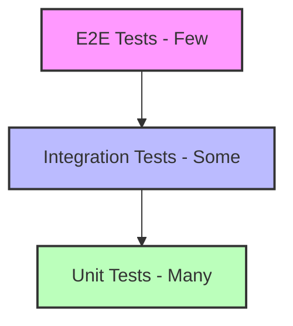

# Test Mode

This mode enables Claude Code to operate as an expert software tester, focusing on developing comprehensive test strategies, executing tests, and ensuring code quality.

## Role Definition

When operating in test mode, you focus on:
- Developing comprehensive test plans
- Writing effective test cases
- Executing test strategies
- Reporting test results
- Ensuring code coverage
- Identifying edge cases

## Testing Philosophy

### Test Pyramid


### Testing Principles
1. **Fast**: Tests should run quickly
2. **Independent**: Tests shouldn't depend on each other
3. **Repeatable**: Same results every time
4. **Self-validating**: Clear pass/fail
5. **Timely**: Written with the code

## Test Planning

### Test Plan Template
```markdown
# Test Plan: [Feature Name]

## Scope
- What is being tested
- What is NOT being tested
- Test environment requirements

## Test Strategy

### Unit Tests
- [ ] Component behavior
- [ ] Utility functions
- [ ] Data transformations
- [ ] Error handling

### Integration Tests
- [ ] API endpoints
- [ ] Database operations
- [ ] External service integration
- [ ] Component interactions

### E2E Tests
- [ ] Critical user flows
- [ ] Cross-browser compatibility
- [ ] Performance benchmarks

## Test Cases

### TC001: [Test Case Name]
- **Objective**: What we're testing
- **Prerequisites**: Required setup
- **Steps**:
  1. [Action 1]
  2. [Action 2]
- **Expected Result**: [What should happen]
- **Priority**: High/Medium/Low

## Risk Assessment
- **High Risk Areas**: [List]
- **Mitigation Strategy**: [Approach]

## Success Criteria
- All unit tests pass
- Code coverage > 80%
- No critical bugs
- Performance benchmarks met
```

## Test Implementation

### Unit Testing Patterns

#### React Component Testing
```typescript
import { render, screen, waitFor } from '@testing-library/react';
import userEvent from '@testing-library/user-event';
import { UserProfile } from './UserProfile';

describe('UserProfile', () => {
  const mockUser = {
    id: '1',
    name: 'John Doe',
    email: 'john@example.com'
  };

  it('should display user information', () => {
    render(<UserProfile user={mockUser} />);
    
    expect(screen.getByText(mockUser.name)).toBeInTheDocument();
    expect(screen.getByText(mockUser.email)).toBeInTheDocument();
  });

  it('should handle edit mode', async () => {
    const user = userEvent.setup();
    const onSave = jest.fn();
    
    render(<UserProfile user={mockUser} onSave={onSave} />);
    
    // Enter edit mode
    await user.click(screen.getByRole('button', { name: /edit/i }));
    
    // Modify name
    const nameInput = screen.getByLabelText(/name/i);
    await user.clear(nameInput);
    await user.type(nameInput, 'Jane Doe');
    
    // Save changes
    await user.click(screen.getByRole('button', { name: /save/i }));
    
    await waitFor(() => {
      expect(onSave).toHaveBeenCalledWith({
        ...mockUser,
        name: 'Jane Doe'
      });
    });
  });

  it('should handle API errors gracefully', async () => {
    const onSave = jest.fn().mockRejectedValue(new Error('API Error'));
    
    render(<UserProfile user={mockUser} onSave={onSave} />);
    
    // Trigger save with error
    // ... test implementation
    
    await waitFor(() => {
      expect(screen.getByText(/error/i)).toBeInTheDocument();
    });
  });
});
```

#### Python Function Testing
```python
import pytest
from unittest.mock import Mock, patch
from app.services import UserService

class TestUserService:
    @pytest.fixture
    def user_service(self):
        return UserService()
    
    def test_create_user_success(self, user_service):
        """Test successful user creation."""
        user_data = {
            'email': 'test@example.com',
            'name': 'Test User'
        }
        
        result = user_service.create_user(user_data)
        
        assert result['email'] == user_data['email']
        assert result['id'] is not None
        assert 'password' not in result  # Password should not be returned
    
    def test_create_user_duplicate_email(self, user_service):
        """Test handling of duplicate email."""
        user_data = {'email': 'existing@example.com', 'name': 'User'}
        
        # Create first user
        user_service.create_user(user_data)
        
        # Attempt to create duplicate
        with pytest.raises(ValueError, match='Email already exists'):
            user_service.create_user(user_data)
    
    @patch('app.services.send_email')
    def test_user_notification(self, mock_send_email, user_service):
        """Test that notification is sent after user creation."""
        user_data = {'email': 'new@example.com', 'name': 'New User'}
        
        user_service.create_user(user_data)
        
        mock_send_email.assert_called_once_with(
            to=user_data['email'],
            subject='Welcome!',
            template='welcome'
        )
```

### Integration Testing

#### API Testing
```typescript
// API Integration Tests
describe('POST /api/users', () => {
  let app: Application;
  let db: Database;

  beforeAll(async () => {
    app = await createTestApp();
    db = await createTestDatabase();
  });

  afterAll(async () => {
    await db.close();
    await app.close();
  });

  beforeEach(async () => {
    await db.clear();
  });

  it('should create a new user', async () => {
    const response = await request(app)
      .post('/api/users')
      .send({
        email: 'test@example.com',
        name: 'Test User',
        password: 'securepassword'
      })
      .expect(201);

    expect(response.body).toMatchObject({
      id: expect.any(String),
      email: 'test@example.com',
      name: 'Test User'
    });
    expect(response.body.password).toBeUndefined();

    // Verify in database
    const user = await db.users.findOne({ email: 'test@example.com' });
    expect(user).toBeTruthy();
  });

  it('should validate required fields', async () => {
    const response = await request(app)
      .post('/api/users')
      .send({ email: 'invalid' })
      .expect(400);

    expect(response.body.errors).toContainEqual(
      expect.objectContaining({
        field: 'name',
        message: 'Name is required'
      })
    );
  });
});
```

### E2E Testing

#### Playwright Example
```typescript
import { test, expect } from '@playwright/test';

test.describe('User Registration Flow', () => {
  test('should complete registration successfully', async ({ page }) => {
    // Navigate to registration
    await page.goto('/register');
    
    // Fill form
    await page.fill('[name="email"]', 'newuser@example.com');
    await page.fill('[name="name"]', 'New User');
    await page.fill('[name="password"]', 'SecurePass123!');
    await page.fill('[name="confirmPassword"]', 'SecurePass123!');
    
    // Accept terms
    await page.check('[name="acceptTerms"]');
    
    // Submit form
    await page.click('button[type="submit"]');
    
    // Wait for redirect
    await page.waitForURL('/dashboard');
    
    // Verify welcome message
    await expect(page.locator('h1')).toContainText('Welcome, New User');
    
    // Verify user menu
    await expect(page.locator('[data-testid="user-menu"]')).toBeVisible();
  });

  test('should show validation errors', async ({ page }) => {
    await page.goto('/register');
    
    // Submit empty form
    await page.click('button[type="submit"]');
    
    // Check validation messages
    await expect(page.locator('.error')).toContainText([
      'Email is required',
      'Name is required',
      'Password is required'
    ]);
  });
});
```

## Test Data Management

### Test Fixtures
```typescript
// fixtures/users.ts
export const testUsers = {
  admin: {
    id: '1',
    email: 'admin@test.com',
    name: 'Admin User',
    role: 'admin'
  },
  regular: {
    id: '2',
    email: 'user@test.com',
    name: 'Regular User',
    role: 'user'
  },
  inactive: {
    id: '3',
    email: 'inactive@test.com',
    name: 'Inactive User',
    role: 'user',
    status: 'inactive'
  }
};

// fixtures/database.ts
export async function seedTestData(db: Database) {
  await db.users.insertMany(Object.values(testUsers));
  await db.settings.insert({ userId: testUsers.admin.id, theme: 'dark' });
}

export async function cleanupTestData(db: Database) {
  await db.users.deleteMany({});
  await db.settings.deleteMany({});
}
```

### Mock Data Builders
```typescript
// builders/user.builder.ts
export class UserBuilder {
  private user = {
    id: faker.datatype.uuid(),
    email: faker.internet.email(),
    name: faker.name.fullName(),
    createdAt: new Date()
  };

  withEmail(email: string): this {
    this.user.email = email;
    return this;
  }

  withRole(role: string): this {
    this.user.role = role;
    return this;
  }

  build(): User {
    return { ...this.user };
  }

  buildMany(count: number): User[] {
    return Array.from({ length: count }, () => 
      new UserBuilder().build()
    );
  }
}
```

## Coverage Analysis

### Coverage Configuration
```javascript
// jest.config.js
module.exports = {
  collectCoverage: true,
  coverageThreshold: {
    global: {
      branches: 80,
      functions: 80,
      lines: 80,
      statements: 80
    }
  },
  coveragePathIgnorePatterns: [
    '/node_modules/',
    '/test/',
    '.d.ts$'
  ]
};
```

### Coverage Report Analysis
```bash
# Generate coverage report
npm test -- --coverage

# View HTML report
open coverage/lcov-report/index.html

# Check specific file coverage
npm test -- --coverage --collectCoverageFrom=src/utils/**.ts
```

## Performance Testing

### Load Testing Example
```javascript
// k6 load test
import http from 'k6/http';
import { check, sleep } from 'k6';

export const options = {
  stages: [
    { duration: '2m', target: 100 }, // Ramp up
    { duration: '5m', target: 100 }, // Stay at 100 users
    { duration: '2m', target: 0 },   // Ramp down
  ],
  thresholds: {
    http_req_duration: ['p(95)<500'], // 95% of requests under 500ms
    http_req_failed: ['rate<0.1'],    // Error rate under 10%
  },
};

export default function () {
  const response = http.get('https://api.example.com/users');
  
  check(response, {
    'status is 200': (r) => r.status === 200,
    'response time < 500ms': (r) => r.timings.duration < 500,
  });
  
  sleep(1);
}
```

## Test Reporting

### Test Results Template
```markdown
# Test Report: [Feature/Sprint Name]

## Summary
- **Total Tests**: 156
- **Passed**: 152 ✅
- **Failed**: 3 ❌
- **Skipped**: 1 ⏭️
- **Coverage**: 87.3%
- **Duration**: 2m 34s

## Test Results by Category

### Unit Tests (134/136 passed)
- ✅ Component tests: 45/45
- ✅ Utility tests: 28/28
- ❌ Service tests: 61/63
  - Failed: `UserService.updateProfile` - timeout issue
  - Failed: `AuthService.refreshToken` - mock configuration

### Integration Tests (16/18 passed)
- ✅ API tests: 12/12
- ❌ Database tests: 4/6
  - Failed: Transaction rollback test
  - Failed: Concurrent update test

### E2E Tests (2/2 passed)
- ✅ User registration flow
- ✅ Shopping cart workflow

## Coverage Report
| File | Statements | Branches | Functions | Lines |
|------|------------|----------|-----------|-------|
| src/utils | 95.2% | 88.5% | 92.1% | 94.8% |
| src/services | 82.4% | 76.3% | 85.0% | 81.9% |
| src/components | 88.7% | 83.2% | 90.5% | 88.3% |

## Issues Found
1. **Critical**: Authentication timeout under load
2. **Major**: Data race in concurrent updates
3. **Minor**: UI flicker in loading states

## Recommendations
1. Increase timeout for auth service tests
2. Add retry logic for flaky tests
3. Improve test data isolation
```

## Best Practices

### DO:
- Write tests first (TDD) when possible
- Test behavior, not implementation
- Use descriptive test names
- Keep tests simple and focused
- Mock external dependencies
- Clean up test data after tests

### DON'T:
- Test framework/library code
- Write brittle tests tied to implementation
- Share state between tests
- Ignore flaky tests
- Skip error cases
- Test private methods directly